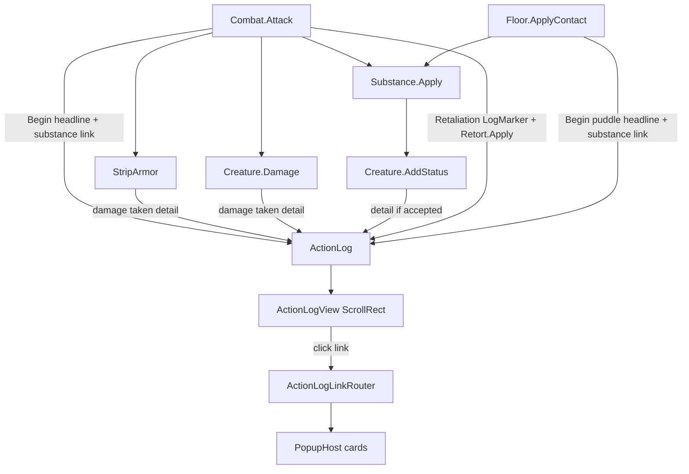

# Архитектура Action Log

История боевых и контактных событий: **модель данных** (`ActionLog`) отделена от **отрисовки** (`ActionLogView`) и от **открытия карточек** (`ActionLogLinkRouter` → `PopupHost`).

Карточки попапов: [popup-cards.md](popup-cards.md).

## Формат (UX)

```
Slime hits Dog with Oil
  Loses HP 1
  Dog gains Instability
```

Headline без отступа (вещество в заголовке — кликабельная ссылка); details с отступом. Дублирующей detail-строки с именем вещества нет. Клики по субстанции/статусу → `PopupHost`. `Dump()` — тот же plain text.

При старте `WorldView`: `ActionLog.Clear` + `AnnounceRunStarted` — дуэль: `Duel started`; кампания: `Campaign started in {Hardcore|Softcore} mode`. Кнопка ▾/▴ поверх первой строки сворачивает лог до последнего headline без details.

Ответный удар остаётся **в той же группе**, что и удар:

```
Rat hits Slime
  Loses volume 1
  Retaliation
  Rat gains Burning
```

## Схема потока записи



## Слои

| Слой | Класс | Ответственность |
| --- | --- | --- |
| Модель | `ActionLog` / `ActionLogEntry` | Кольцевой буфер групп, стек `Begin` / `Detail` / `End`, `Dump`, `Changed`; `Details` снаружи — `IReadOnlyList` |
| Строка | `ActionLogLine` | Список `ActionLogPart` (plain / Status / Substance / Creature); `Text` = склейка для Dump |
| UI | `ActionLogView` | ScrollRect (липнет вниз только если уже у низа), рендер, кликабельные фрагменты |
| Роутинг | `ActionLogLinkRouter` | `LinkKind` → `PopupHost.Push` (или `CustomOpen`) |
| Инструментация | `Combat`, `Floor`, `Creature.AddStatus` | Каждый сайт пишет **свой** кусок группы |

`ActionLog` **не знает** про UI и попапы. `ActionLogView` **не знает** доменных правил боя — только рисует `Entries` и отдаёт клик роутеру.

## Принципы

### 1. Группа = одно событие

```
BeginKey(TextKey.Log…, ActionLogPart.Creature(…), …)
  DetailKey… / DetailGains… / DetailSubstance…
End()   // обычно в finally
```

- Headline без отступа; details с отступом в `Dump` и в UI.
- `Begin` / `End` — **настоящий стек**: вложенный `Begin` не закрывает внешнюю группу; `Detail` идёт в innermost; внешний `End` в `finally` не сносит чужую группу и не теряет детали.
- Без открытой группы `Detail*` молча игнорируются (не создаём «сиротские» группы).

### 2. Каждый сайт пишет свой срез

Не центральный «логгер боя», а локальные вызовы:

| Сайт | Что пишет |
| --- | --- |
| `Combat.Attack` | `Begin`, урон, `DispatchSurvivedHitReactions` / `NotifyDealtMeleeHit` / `NotifyStruckVolumeTip` (логи пишут сами эффекты), `dies`, `End` |
| `Creature.AddStatus` | `DetailGains` только если статус **принят** и группа открыта |
| `Floor.ApplyContact` | `Begin` (вещество в headline), Apply → gains / vampirism heal, `End` |
| `TurnManager` turn-start | `Begin` (`{Kind}'s turn`), pulse statuses (incl. `Digesting` — bulk absorb + unique substances on final pulse), mid-pulse dominance, `End(discardIfEmpty)` |
| `TurnManager.TryCollectPuddle` | `Begin` (collect + substance link), volume add, dominance, `End` |
| `TurnManager.TryMakeMess` | `Begin` (spill + substance link), dominance, `End` |
| `TurnManager.TryDevourCorpse` | `Begin` (`begins digesting {Kind}`), `AddStatus(Digesting)` → gains, `End`; finish later in turn-group |

Новый источник событий (Mess, DoT pulse, Devour) добавляется так же: обернуть логику в `Begin`/`End` и вызывать `Detail*` из места знания факта.

### 3. Dump — всегда plain text

`ActionLog.Dump()` склеивает `ActionLogLine.Text` (конкатенация Parts). Typed-данные в Parts нужны только UI/роутеру и **не** добавляют отдельный текст сверх Parts.

### 4. Клики — через Parts + роутер

Строка лога — список `ActionLogPart` (plain / Status / Substance / Creature). `Text` = склейка Parts для `Dump()`.

- `BeginKey` / `DetailKey` / `ActionLogLine.Format` собирают Parts из i18n-шаблона `{0}`… и typed args.
- UI рендерит каждый Part; клик → `ActionLogLinkRouter.Open(part)` (без `LastIndexOf`).
- Creature → `CreatureKindCard`; Status → `StatusCard`; Substance → `SubstanceCard`.

### 5. Нулевые эффекты не шумят

- Урон: `FormatDamageDetail` → `Loses …`, опускает нулевые части; вся строка может отсутствовать.
- Статус: gains только после успешного `StatusQueue.Add`.
- Смерть: отдельная detail-строка только если `!target.IsAlive` после удара.
- Пустой turn-group без details отбрасывается (`End(discardIfEmpty: true)`).

### 6. Скролл и UI

`ActionLogView` **дописывает** новые headline/detail строки; полный rebuild только при смене `ActionLog.Generation` (Clear / trim кольца / discard пустой группы).

Скролл прыгает вниз только если контент не переполнен **или** `verticalNormalizedPosition` уже у низа (≤ 0.01).

## Как добавить новое событие в лог

1. В коде, который **знает** факт (не в View):
   ```csharp
   ActionLog.BeginKey(TextKey.LogHitWith,
       ActionLogPart.Creature(a.Kind),
       ActionLogPart.Creature(b.Kind),
       ActionLogPart.Substance(oil));
   try {
       // … механика …
       ActionLog.DetailGains(…);      // Parts: Creature + Status
   } finally {
       ActionLog.End();
   }
   ```
2. Строки через `I18n` / `TextKey` (`log.*`); кликабельные куски — `ActionLogPart.*`.
3. EditMode-тест: `Dump()` содержит ожидаемые строки; после `End` `HasOpenGroup == false`.
4. Обновить таблицу сайтов выше и этот раздел «Формат».

**Не** пишите в лог из `ActionLogView` и **не** дублируйте один факт из двух сайтов (например gains только из `AddStatus`, не из `Combat` вручную; вещество — Part в headline, не второй detail-строкой).

## Как добавить новый кликабельный тип ссылки

Сейчас: `None | Status | Substance | Creature`.

1. Значение в `ActionLogLinkKind`.
2. Фабрика `ActionLogPart.Xxx(...)`.
3. Ветка в `ActionLogLinkRouter.Open(ActionLogPart)` → `host.Push(...)`.
4. UI рендерит Parts как есть (`ActionLogView.AddPartsLine`).
5. Либо временно: `CustomOpen` без правки enum.

Снимок данных делайте в момент лога (`StatusLogRef.From`, `Substance.Clone`, `CreatureKind`), не держите живые ссылки на сцену в кольцевом буфере.

## Файлы

| Путь | Роль |
| --- | --- |
| `Assets/Scripts/Runtime/App/ActionLog.cs` | Parts + Format + модель |
| `Assets/Scripts/Runtime/App/ActionLogView.cs` | UI по Parts |
| `Assets/Scripts/Runtime/App/ActionLogLinkRouter.cs` | клик Part → попап |
| `Assets/Scripts/Runtime/App/Cards/CreatureKindCard.cs` | карточка Kind из лога |
| `Assets/Scripts/Runtime/Turns/Combat.cs` | удар |
| `Assets/Scripts/Runtime/World/Floor.cs` | лужа |
| `Assets/Scripts/Runtime/Creatures/Creature.cs` | gains |
| `Assets/Tests/Editor/App/ActionLogTests.cs` | регрессии |

## Вне текущего скоупа (но стыкуется с принципами)

- Devour begin — headline `log.devours`; finish — detail `log.digests` в turn-group.
- Автозапись `Dump()` в файл — потребитель модели, без смены Begin/Detail/End.
