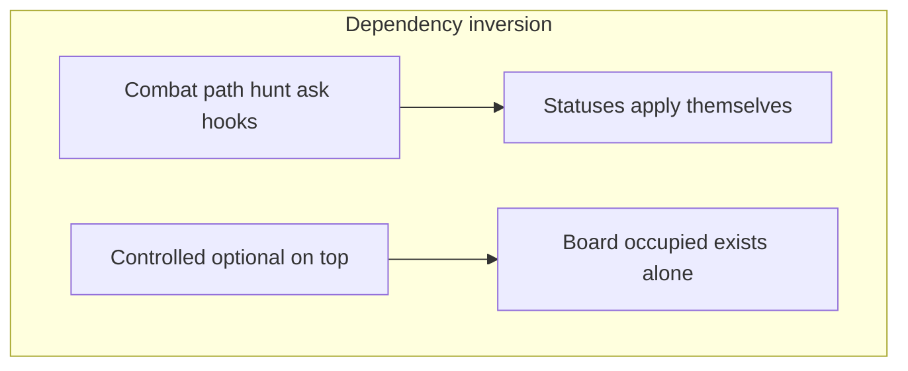

# Dependency inversion

One project-wide principle with **two layers**: statuses apply themselves, and the **board does not depend on a player**.

Canonical Cursor rule: [`.cursor/rules/dependency-inversion.mdc`](../../.cursor/rules/dependency-inversion.mdc). Status catalog: [docs/status-effects.md](../status-effects.md). Behavior overview: [docs/behavior.md](../behavior.md).



| Layer | Forbidden direction | Correct |
| --- | --- | --- |
| Statuses / skills | Combat / Moves / GridPath knows `Poisonous` / `HatesCats` by name | Hooks on `StatusEffect` (`IsPrey`, `FloorPriorityOverride`, …) |
| World ↛ player | `GameSession` requires a player cell; hunt sims must spawn/hide a slime | Board = unified `occupied`; controlled optional; `Player == null` → Idle/Wander → hunt |

---

## Statuses apply themselves

**Combat, movers, and pathfinding do not know which skills exist.** They emit neutral events or ask generic questions. **Statuses apply themselves** by overriding hooks on `StatusEffect`.

| Hook / API | Who calls | Who implements |
| --- | --- | --- |
| `OnOwnerDealtMeleeHit` | Combat via `NotifyDealtMeleeHit` | e.g. `Poisonous` |
| `OnOwnerSurvivedHit` | Combat after damage | e.g. `Retaliation` |
| `OnOwnerReceivedSubstance` | After `Substance.Apply` | e.g. `Vampirism` |
| `Blocks` / `CancelsWith` | Status queue | immunity / Wet↔Burning |
| `FloorPriorityOverride` | `Substance.FloorPriorityFor` ← GridPath | `Poisonous`, `FearsWater` |
| `IsPrey` / `IsPredator` | `CreatureHunt` | `HatesCats`, `FearsDogs`, … |

Hard rules (summary):

1. No skill switches in `Combat` / pathfinding / hunt matching.
2. Notify, don’t interpret — statuses decide.
3. Personality ≠ status — no `FearsSlimes` / `HatesSlimes`.
4. Same `Substance.Apply` for strike residue and puddle contact.

Full good/bad examples live in the Cursor rule.

---

## World ↛ player

The **board** is `World` + `GameSession.occupied` (every living body). A **controlled** creature is optional input on top of that board — not a hole outside occupancy, and not a requirement for the world to exist.

### Terminology

| Term | Meaning |
| --- | --- |
| **Board / occupied** | All bodies on the map; independent of whether anyone is player-controlled |
| **Controlled** | Optional WASD / attack target: `TurnManager.Controlled` + `GameSession.ControlledCell` |
| **`CreatureTurnContext.Player`** | Personality focus (usually the slime). **Nullable.** Not “must exist on the board.” |

### API

```csharp
// Board only (hunt sims, cutscenes)
var session = new GameSession(world, dogAndCatCells);
// or SessionFactory.Board(world, dog, cat);

// With player input
var session = new GameSession(world, allCells);
session.SetControlled(slime.Cell);
// or SessionFactory.WithControlled(world, slime, dog, cat);

turns.Bind(world, controlled: slime, dog, cat);
turns.Bind(world, controlled: null, dog, cat); // board-only via TurnManager
```

Rules:

1. Every living participant’s cell is in `occupied` (including the slime when present).
2. `SetControlled(cell)` only binds a cell that is already occupied; `null` clears control.
3. Input APIs (`TryStep`, `TryAttack`, …) return `false` when `ControlledCell` is null.
4. Occupant movement has **no** special “cannot step onto PlayerCell” hole — the controlled cell is a normal occupied cell.
5. AI: `TakeTurn(session, player: null, …)` is valid. Behavior conditions vs player are false → Idle/Wander → `CreatureHunt.Redirect` owns mob↔mob.

### Tests

```csharp
// ❌ BAD — inflate the map and hide a fake slime so Aggressive never sees it
var world = World.CreateGrass(20);
var player = Spawn<Slime>(new Vector2Int(19, 19));
dog.TakeTurn(session, player, rng, others);

// ✅ GOOD — board-only; null personality focus; hunt redirect
var world = World.CreateGrass(10);
var session = SessionFactory.Board(world, dog, cat);
dog.TakeTurn(session, player: null, rng, others);
```

Do **not** pad maps or park a slime at the edge to “disable” personality. Prefer no slime when the scenario is mob↔mob.

### What we deliberately do not do

- No `IGameWorld` / `IPlayerController` service layer for this.
- No `if (!HasPlayer)` branches inside Combat.
- Sticky personality-vs-slime when the slime **is** on the map and in vision stays unchanged.
