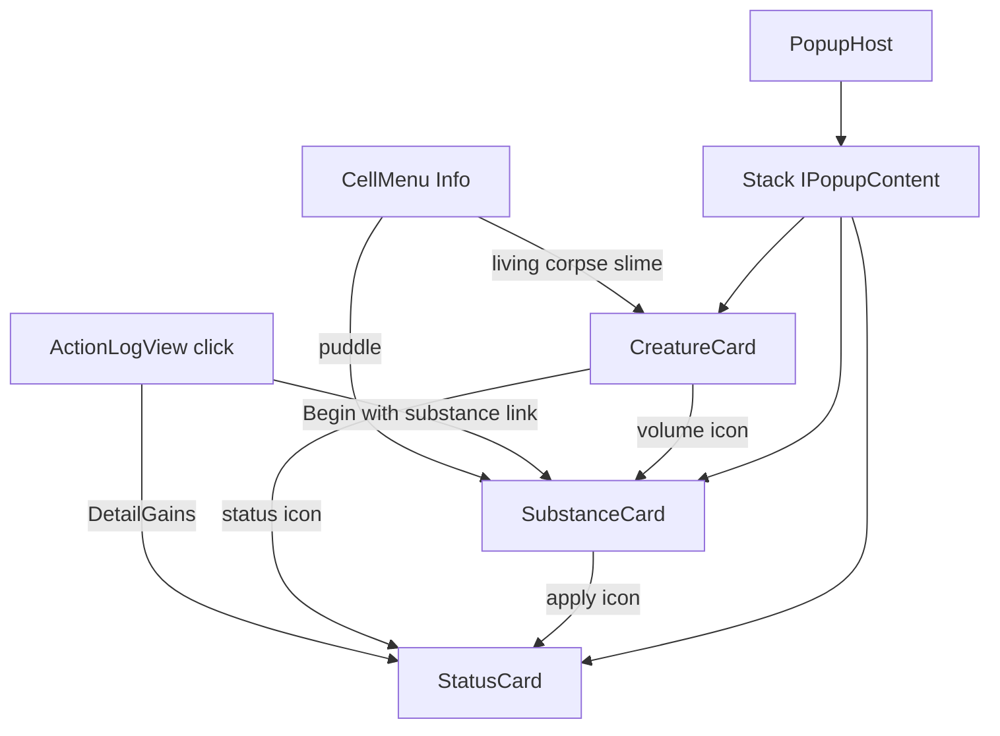

# Архитектура Popup Cards

Оболочка попапа (`PopupHost`) отделена от содержимого карточек (`IPopupContent`). Меню действий клетки (`CellMenu`) — **другой** попап и в этот стек не входит.

Связь с логом: [action-log.md](action-log.md).

## Схема навигации



## Слои

| Слой | Тип | Ответственность |
| --- | --- | --- |
| Shell | `PopupHost` | Canvas, footer Back, стек; **`Dim`** (флаг) включает полноэкранный dim на refresh; `BlocksInput` = `Dim && IsOpen` |
| Контракт | `IPopupContent` | `Build(parent, host)` — только контент |
| Карточки | `CreatureCard` / `SubstanceCard` / `StatusCard` | вёрстка + `host.Push` по клику |
| UI-хелперы | `CardUi` | title, text, portrait, icon button |
| Иконки | `IconCatalog` | `Resources/Icons` + `Register*` |
| Домен | `Substance` / `StatusEffect` | `Icon`, `Description`, `CollectApplyPreview` |

`PopupHost` **не** знает про существ и субстанции — только стек `IPopupContent`.  
Карточка **не** создаёт свой Canvas — только детей в `contentRoot`.

## Принципы

### 1. Shell vs content

- Один хост на сессию (`PopupHost.Ensure()` / `Instance`; bootstrap из `WorldView`, иначе создаётся при первом клике из лога/Info).
- `Push` / `Back` / `Close`: кнопка Back делает **один** pop; пустой стек → скрыть canvas. Стек карточек без лимита.
- **`Dim`** (по умолчанию `false`): на каждой отрисовке (`Refresh`) dim включается/выключается одним флагом. Info/лог оставляют `false` — мир и лог кликабельны. Choice-blocking сценарий: `host.Dim = true` до/во время показа.
- Клик по dim (когда включён) = `Back`. `BlocksInput` следует за `Dim`.
- Отдельный всегда-включённый dim у `CellMenu` / Game Over — свои оболочки выбора, не `PopupHost`.
- `sortingOrder` хоста выше CellMenu (220 vs 200), чтобы карточки перекрывали меню действий.

### 2. Карточка — единственная единица стека

Любой экран в этом попапе реализует `IPopupContent`. Вложенность = `host.Push(new OtherCard(...))` из кнопки внутри `Build`.

Не кладите «половинки» UI в `PopupHost` и не открывайте второй Canvas из карточки.

### 3. Домен отдаёт данные для UI, не строит UI

| API | Зачем |
| --- | --- |
| `StatusEffect.Label` / `Description` / `Icon` / `Remaining` / `Permanent` | `StatusCard` и лог |
| `Substance.Label` / `Color` / `Power` / `Corrosion` / `Icon` / `Clone` | `SubstanceCard` |
| `Substance.CollectApplyPreview` | иконки «Applies» (удар/лужа) **без** сайд-эффектов `OnApply` |
| `Substance.CollectDominancePassives` | иконки «Dominance» (пассивы доминанты: Fireproof, Forever Flammable, Regeneration, Retaliation) |
| `Creature` + `Volume` / `Statuses` | `CreatureCard` |

Превью статусов субстанции **не** вызывает `AddStatus` / `Drink` — только экземпляры для отображения и клика.

### 4. Иконки регистрируются явно

Плейсхолдеры: `Assets/Resources/Icons/`, генератор `scripts/generate_ui_icons.py`.

```csharp
IconCatalog.RegisterSubstance(typeof(SlimeGoo), "Icons/substance_slime_goo");
IconCatalog.RegisterStatus(typeof(Frozen), "Icons/status_frozen");
```

Без регистрации `Icon` вернёт `null` → `CardUi` рисует цветной fallback. Для продакшена регистрация + PNG обязательны.

### 5. Кто угодно может Push — один хост

| Источник | Что пушит |
| --- | --- |
| `CellMenu.ShowInfoPanel` | `CreatureCard` / `SubstanceCard` |
| `ActionLogLinkRouter` | `StatusCard` / `SubstanceCard` |
| Иконки на карточках | вложенные карточки |

`PlayerInput` блокируется при `PopupHost.BlocksInput`.

## Как добавить новую карточку

1. Класс `sealed class FooCard : IPopupContent` в `Assets/Scripts/Runtime/App/Cards/`.
2. В `Build`:
   - использовать `CardUi` (единый шрифт/стиль);
   - дляdrill-down: `host.Push(new SubstanceCard(...))` / другая карточка;
   - не трогать dim/footer.
3. Точки входа: Info / лог / другая карточка вызывают `PopupHost.Ensure().Push(new FooCard(...))`.
4. i18n: ключи `card.*` / свои в `TextKey` + Shared/en/ru.
5. Тест: после Push `PopupHost.Instance.PeekType == typeof(FooCard)`; TearDown `Close`.

Пример скелета:

```csharp
public sealed class FooCard : IPopupContent
{
    public void Build(RectTransform parent, PopupHost host)
    {
        CardUi.AddTitle(parent, "Foo");
        CardUi.AddBodyText(parent, "…");
        // CardUi.AddIconButton(row, sprite, color, () => host.Push(new StatusCard(effect)));
    }
}
```

## Как добавить новую субстанцию (с карточкой и логом)

1. Класс `: Substance` — `Color`, `Label`, `Clone`, `OnApply`, при необходимости `CollectApplyPreview`.
2. PNG `Icons/substance_<name>.png` (+ запись в `generate_ui_icons.py` или ручной арт).
3. `IconCatalog.RegisterSubstance(typeof(MySubstance), "Icons/substance_<name>")` (или строка в built-in map).
4. Удары/лужи уже кладут вещество через `BeginKey(..., ActionLogPart.Substance(...))` (link в headline); Info → карточка подхватит `Icon` и preview.
5. Тест `CollectApplyPreview` на ожидаемые типы статусов.

## Как добавить новый статус-эффект (с карточкой и логом)

1. Класс `: StatusEffect` (или `OverTime` / `TickingHarm` / innate) — `Label`, `Description`.
2. PNG `Icons/status_<name>.png` + `IconCatalog.RegisterStatus`.
3. Gains в логе появятся сами из `Creature.AddStatus` → `DetailGains`, если открыта группа.
4. `StatusCard` покажет Description и таймер (`Permanent` / `Remaining`) без правок карточки.
5. Если субстанция накладывает эффект — добавить его в `CollectApplyPreview` этой субстанции.

## Как связать новый клик из Action Log с карточкой

См. [action-log.md](action-log.md) § «кликабельный тип ссылки». Обычно:

```csharp
// в ActionLogLinkRouter.Open
host.Push(new FooCard(...));
```

или прототип через `ActionLogLinkRouter.CustomOpen`.

## Файлы

| Путь | Роль |
| --- | --- |
| `Assets/Scripts/Runtime/App/PopupHost.cs` | shell + стек |
| `Assets/Scripts/Runtime/App/IPopupContent.cs` | контракт |
| `Assets/Scripts/Runtime/App/Cards/*.cs` | карточки + `CardUi` |
| `Assets/Scripts/Runtime/App/IconCatalog.cs` | спрайты |
| `Assets/Scripts/Runtime/Turns/CellMenu.cs` | Info → Push |
| `Assets/Resources/Icons/` | PNG |
| `scripts/generate_ui_icons.py` | плейсхолдеры |

## Граница с CellMenu

- **CellMenu**: кнопки Attack / Mess / Collect / Devour / Info picker — свой canvas и `Stack<Action>` рендеров.
- **PopupHost**: только info-карточки и drill-down.
- Info **не** пушит уровень в `CellMenu.levels` — только `PopupHost.Push`.

Перенос корневого меню в `PopupHost` сознательно вне скоупа; при необходимости меню стало бы ещё одним `IPopupContent`, без смешивания с карточками существа.
